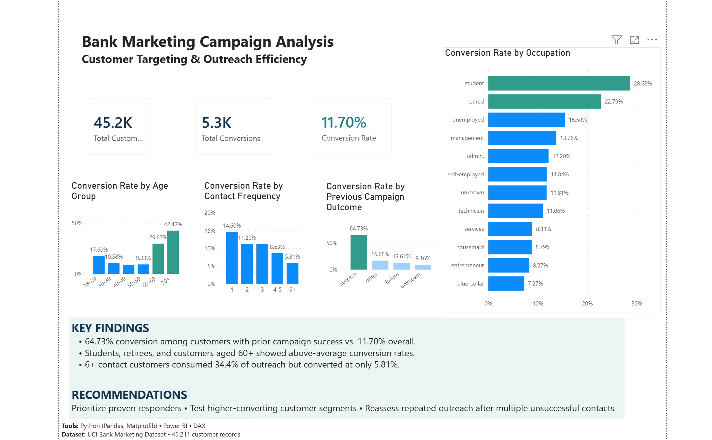

# Bank Marketing Campaign Analysis
### Customer Targeting & Outreach Efficiency

**Tools:** Python (Pandas, Matplotlib) | Power BI | DAX  
**Dataset:** UCI Bank Marketing Dataset | 45,211 customer records

## Project Overview

A Portuguese bank conducted direct marketing campaigns to encourage customers to subscribe to term deposits. However, contacting more customers does not necessarily translate into higher conversion rates, particularly when marketing resources are limited.

In this project, I analyzed 45,211 customer records to understand which customer segments were more likely to subscribe, how previous campaign outcomes related to conversion, and whether repeated outreach was associated with lower campaign efficiency.

Using Python for data analysis and Power BI for visualization, I developed recommendations to help the bank make more informed customer targeting and outreach decisions.

## Business Questions

1. Which customer segments have the highest term-deposit conversion rates?
2. How does previous campaign performance relate to customer conversion?
3. How does contact frequency relate to campaign efficiency?
4. How can the bank improve its customer targeting and allocation of outreach resources?

## Methodology

### 1. Data Preparation
- Imported the UCI Bank Marketing dataset into Google Colab using Python and Pandas.
- Examined the dataset structure, which contained 45,211 customer records and 17 original variables.
- Created a binary `converted` variable to distinguish customers who subscribed to a term deposit from those who did not.
- Grouped customers into age ranges and campaign contact-frequency categories to support comparison across segments.

### 2. Exploratory Data Analysis
- Calculated the overall campaign conversion rate as a performance benchmark.
- Compared conversion rates across customer occupations and age groups.
- Examined how previous campaign outcomes related to current conversion rates.
- Analyzed contact frequency, total campaign contacts, and contacts per conversion to assess outreach efficiency.

### 3. Data Visualization
- Used Matplotlib to visualize conversion patterns during the Python analysis.
- Exported the prepared dataset as a CSV file.
- Imported the dataset into Power BI and created DAX measures for total customers, total conversions, and conversion rate.
- Developed an interactive dashboard presenting campaign performance, customer segments, previous campaign outcomes, and outreach efficiency.

## Power BI Dashboard

## Key Findings

### 1. Overall Campaign Performance

The campaign contacted **45,211 customers**, of whom **5,289 subscribed** to a term deposit, resulting in an overall conversion rate of **11.70%**.

This conversion rate served as the benchmark for evaluating customer segments and campaign outreach performance.

### 2. Customer Demographics Reveal Targeting Opportunities

Conversion rates varied considerably across customer segments.

- **Students:** 28.68% conversion rate, the highest among occupational groups.
- **Retirees:** 22.79% conversion rate.
- **Customers aged 60–69:** 29.67% conversion rate.
- **Customers aged 70+:** 42.42% conversion rate.
- **Customers aged 18–29:** 17.60% conversion rate.

In contrast, blue-collar customers represented the largest occupational segment contacted but recorded a conversion rate of just **7.27%**.

**Business Insight:** The bank could test greater emphasis on higher-converting demographic segments instead of relying primarily on the volume of customers contacted. However, segment size and overlapping demographic characteristics should be considered before changing targeting decisions.

### 3. Previous Campaign Success Is a Strong Indicator of Conversion

Customers with a successful previous campaign outcome recorded a **64.73% conversion rate**, compared with **11.70% overall**.

Customers whose previous campaign outcome was unknown converted at **9.16%**.

**Business Insight:** Historical campaign outcomes could help identify promising customers for future outreach. However, previous outcome information was unavailable for most customers, limiting how broadly this strategy could be applied.

### 4. Repeated Outreach Is Associated With Lower Campaign Efficiency

Conversion rates declined across groups with higher campaign contact frequency.

| Campaign Contacts | Conversion Rate |
|---|---|
| 1 | 14.60% |
| 2 | 11.20% |
| 3 | 11.19% |
| 4–5 | 8.63% |
| 6+ | 5.81% |

Customers contacted **six or more times** accounted for approximately **9.6% of customers but 34.4% of all campaign contacts**.

The group required approximately **169.7 campaign contacts per conversion**, compared with **6.9 contacts per conversion** among customers contacted once.

**Business Insight:** High-frequency outreach consumed a disproportionate share of campaign activity while producing lower conversion rates. The bank should review whether repeated contacts are an efficient use of marketing resources.

These findings describe associations, not causal effects. Customers who had not converted may have been contacted more frequently, contributing to the observed pattern.

## Business Recommendations

Based on the analysis, I identified three opportunities to improve customer targeting, campaign performance, and marketing resource allocation.

### 1. Prioritize Customers Based on Previous Campaign Performance

Customers with successful previous campaign outcomes recorded a 64.73% conversion rate, significantly above the overall campaign average of 11.70%.

I recommend incorporating historical campaign performance into customer segmentation. Customers with previous successful outcomes could receive greater priority, while customers with limited engagement history could be included in targeted testing campaigns.

From a marketing perspective, this would allow the bank to move away from broad, uniform outreach toward a more behavior-based targeting strategy.

**Success metrics:** Conversion rate by segment, cost per acquisition, and incremental conversions.

### 2. Develop Segment-Specific Marketing Campaigns

Students, retirees, and older customers demonstrated above-average conversion rates, suggesting opportunities for more focused customer segmentation.

Rather than using identical messaging across all customers, the bank could test different value propositions based on customer needs. For example, campaigns targeting younger customers could explore savings goals and financial planning, while campaigns targeting retirees could emphasize clearly communicated deposit terms and predictable returns.

These messaging approaches would need to be validated through customer research and A/B testing, as the dataset does not directly capture customers' motivations.

**Success metrics:** Segment-level conversion rate, message response rate, and acquisition cost.

### 3. Optimize Contact Frequency and Marketing Resources

Customers contacted six or more times accounted for 34.4% of campaign contacts but converted at only 5.81%.

I recommend reviewing outreach strategies after several unsuccessful contact attempts and testing whether reducing repeated calls improves campaign efficiency.

The bank could compare its existing outreach approach against a revised contact-frequency strategy, measuring whether it achieves similar conversions with fewer calls.

This would help the marketing team allocate resources based on campaign performance rather than contact volume alone.

**Success metrics:** Contacts per conversion, cost per acquisition, and incremental conversions.

## Limitations

- **Correlation vs. causation:** The analysis identifies relationships but cannot establish that demographic characteristics or repeated calls directly influence conversion.
- **Incomplete campaign history:** Previous campaign outcomes were unknown for most customers.
- **Customer motivations:** The dataset does not explain why customers subscribed, so messaging recommendations require further research.
- **Financial performance:** Campaign costs and deposit values were unavailable, preventing a complete return-on-investment analysis.

## Conclusion

This project demonstrates how data analysis can inform customer segmentation, campaign targeting, and marketing resource allocation.

By combining historical campaign performance with customer-level insights, I identified opportunities to prioritize promising audiences, test more relevant messaging, and improve outreach efficiency.

The next step would be to validate these recommendations through controlled marketing experiments before implementing them at scale.
